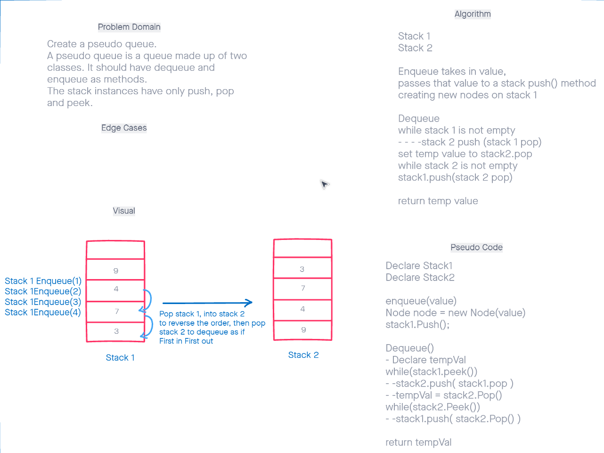

# Stack-Queue-Pseudo
Using two stacks, manipulate them using the interface for a queue
## Authors
Benjamin Ibarra  
Jona Brown
## Challenge
Using 2 stacks which operate in a last in first out interface, manipulated the stacks with a queue interface of first in first out
## Approach & Efficiency
Use the one stack to mirror the other, running the stack methods, with in the Enqueue and Dequeue methods to established the desired first in first out interface on a stack
# Visual

